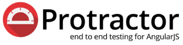





# Automação do Banco de Talentos TOTVS utilizando o framework Protractor

 ## Porque Protractor?
 
 [Protractor](http://angular.github.io/protractor) é um framework open source de testes end-to-end automatizados para aplicações [Angular](http://angular.io/) e [AngularJS](http://angularjs.org). Protractor é uma aplicação [Node.js](http://nodejs.org/) construído sobre o [WebDriverJS](https://github.com/SeleniumHQ/selenium/wiki/WebDriverJs). Protractor executa os testes em sua aplicação em um browser real, interagindo como um usuário real faria.

### Instalação

1. Instale o Node.js:
https://nodejs.org/en/download/

2. Abra o CMD e execute o seguinte comando para instalar o Protractor:
```
	> npm install protractor -g
```
3. Execute o seguinte comando para realizar update do webdriver-manager.
```
	> webdriver-manager update
```

4. Realize um clone do projeto.

### Execução

**A execução dos arquivos somente é possível para os funcionários da TOTVS que possuem acesso ao Banco de Talentos.**

 Abra o arquivo protractor.conf.js e verifique qual o valor do parâmetro *directConnect*.

 Abra o CMD e vá até a pasta aonde está o arquivo protractor.conf.js

##### Caso *directConnect = true*
 Envie o seguinte comando no CMD para iniciar o teste:
```
	> protractor
```
	
##### Caso *directConnect = false* ou ausente
2. Envie o seguinte comando no CMD para iniciar o Webdriver:
	webdriver-manager start
3. Envie o seguinte comando no CMD para iniciar o teste:
```
	> protractor
```

## Dicas
 O Protractor usa a sintaxe Jasmine, então:
 * Se você precisa executar apenas um caso de teste específico, altere o '**it**' para '**fit**';
 * Se quiser ignorar um caso de teste específico, altere o '**it**' para '**xit**';
 * Se você quiser executar apenas um conjunto de teste específico, altere o '**describe**' para '**fdescribe**'.
 * Se você quiser ignorar um conjunto de teste específico, altere o '**describe**' para '**xdescribe**'.
 
## Para mais informações
### Sites
 * [Documentação oficial](http://www.protractortest.org/#/)
 * [Protractor style guide](https://github.com/angular/protractor/blob/master/docs/style-guide.md#page-objects)
	 * Leitura OBRIGATÓRIA, pois há ótimas regras de como deve ser a arquitetura do testes no Protractor.
 * [Fórum Agile Tester](https://agiletesters.com.br)
   * Caso a resposta para a sua dúvida não seja encontrada na internet e procura apoio de pessoas capacitadas, poste a mesma no fórum Agile Tester, seus membros são pessoas receptivas e colaborativas. 
 * [Usos dos 'Before' e 'After'](http://timothymartin.azurewebsites.net/protractor-before-and-afters/)
 * [Talking about Testing](https://talkingabouttesting.com/)
 * [Medium do Walmyr Filho](https://medium.com/@walmyrlimaesilv)
 * [Cursos em Vídeo Aula de Protractor em PT-BR](http://code-squad.com/curso/Curso-Protractor-Automacao-de-testes-end-to-end-para-aplicacoes-Angular-JS/avulso)
 * [Github do conf.js](https://github.com/angular/protractor/blob/5.1.2/lib/config.ts)
 
### Livros

 * [Protractor - Lições sobre testes end-to-end automatizados](https://www.casadocodigo.com.br/products/livro-protractor)

## Mais informações

 **Autor:**
 [Paulo Henrique Rocha Gonçalves](https://www.linkedin.com/in/paulo-goncalves/)

### Arquitetura dos arquivos
```
Protractor/
 |
 ├──page_objects/                   * Diretório contendo todos os page objects utilizados nos testes
 |   ├──Mensagens.po.js             * Page object que agrupa todas as mensagens de alerta da página
 |   ├──QueroMeCadastrar.po.js      * Page object do spec 'QueroMeCadastrar.spec.js'
 |   ├──Login.po.js                 * Page object do spec 'Login.spec.js'
 |   └── *.po.js                    * Outros page objects
 |
 ├──specs/                          * Diretório contendo todos os casos de teste
 |   ├──QueroMeCadastrar.spec.js    * Teste da página 'Quero Me Cadastrar'
 |   ├──Login.spec.js               * Teste da página 'Login'
 |   └── *.spec.js                  * Outros specs
 |
 ├──images/                         * Diretório contendo as imagens do Readme.md
 |
 ├──ElementFinder.js                * Pequena biblioteca de ações (Clicar, EnviarTexto e Limpar)
 ├──helper.js                       * Biblioteca de funções utilizadas em todas as páginas
 ├──protractor.conf.js              * Configuração do projeto
 ├──protractor-pequeno.png          * Imagem utilizada no Readme.md
 ├──README.md
 └──TOTVS-Banco_de_Talentos.png     * Imagem utilizada no Readme.md
  ```

- - - -